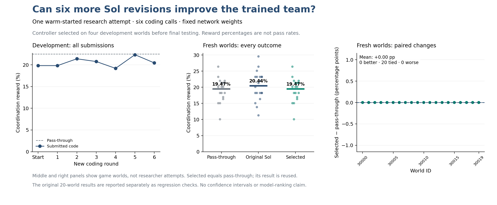
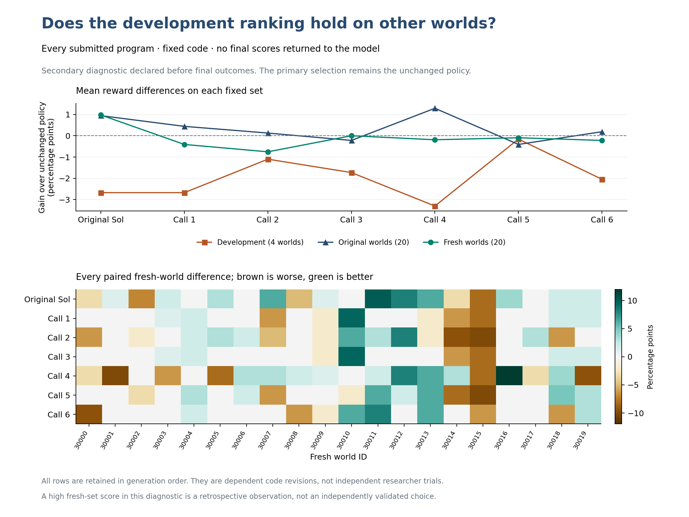

# Can Sol improve a trained team's coordination?

Research note, 24 September 2026. This completed study supports the Alem
evaluation-task proposal to OpenRSI. It has not been submitted as an independent
paper to a publication venue.

We gave Sol six more chances to write a controller for three trained game
agents. All six programs ran successfully on the development worlds. The best
new program scored 22.3270%, just below the unchanged team's 22.4843%. The rule
set before the experiment therefore selected the unchanged team.

The completed diagnostic evaluated every revision on both twenty-world sets.
**None of the six new revisions beat the original Sol controller on the fresh
worlds.** The highest new mean was 19.4654%, effectively tied with the unchanged
reference. These additional iterations did not produce the improvement we
wanted in this study.

On the fresh twenty worlds, the original Sol controller scored **20.4403%**
and the unchanged reference scored **19.4654%**. The selected system equals
the reference, so its gain is exactly zero. The original controller's advantage
is **0.9748 percentage points**, with eleven worlds better, four tied and five
worse. This is a fixed secondary comparison; it does not change the development
winner.

## What is being evaluated?

The researcher is an LLM, requested as `gpt-6-sol` with `ultra` reasoning through
the local Codex runner. It reads a task packet, writes Python code, receives
development scores, and can revise its code. There are six new coding calls.

The players are three existing recurrent reinforcement-learning policies in
[Alem](https://arxiv.org/abs/2606.08340v1), a survival and cooperation game.
Each player's Python controller can use its allowed local observation, the
trained policy's proposed action and scores, and private memory. It chooses a
legal action. Players can send the game's four native messages; sending one
uses a turn. The trained network weights stay fixed. The LLM is not called
during play, and the players are not three chatbots talking to each other.

The unchanged reference simply follows the trained policy. The score is the
mean official normalized coordination reward, shown as a percentage. It is
**not a pass rate**. We also retain ordinary reward, coordination components,
action changes, communication use, runtime and every world's outcome.

The Hard setting, three-player team, checkpoint and observation interface are
fixed. The controller may replace any legal action, so we have not established
that a successful controller must depend on the learned policy. The checkpoint
directory's `1B` means training steps, not one billion network parameters.

## How the six-call study was fixed

The [protocol](EXTENSION-PROTOCOL.md), evaluator and prompts were committed
before the first new coding call. We started from the original Sol controller,
but allowed the unchanged reference to win. Every call received the same public
task packet and the declared history of development feedback. Final-world
results were not returned to the model. The six calls completed without a
replacement response or manual repair of their submitted code.

| Worlds | Count | Use |
| --- | ---: | --- |
| 20000–20003 | 4 | Development feedback and selection |
| 9999–10018 | 20 | Replay the original workload; previously used results |
| 30000–30019 | 20 | New-world evaluation after selection |

The last set is a new fixed range from the same generator. It does not test a
new game, checkpoint or difficulty, and we cannot prove absence from model
training data. Identical candidate bytes on the same suite reuse one result;
they are not counted as separate evidence. A failed or incomplete suite is
unscored, never silently zero or averaged over its successful worlds.

| Program | Development coordination reward |
| --- | ---: |
| Unchanged reference — selected | 22.4843% |
| Original Sol controller | 19.8113% |
| New call 1 | 19.8113% |
| New call 2 | 21.3836% |
| New call 3 | 20.7547% |
| New call 4 | 19.1824% |
| New call 5 | 22.3270% |
| New call 6 | 20.4403% |

| Final comparison | Original twenty worlds | Fresh twenty worlds |
| --- | ---: | ---: |
| Unchanged reference | 18.5220% | 19.4654% |
| Original Sol controller | 19.4654% | 20.4403% |
| Development-selected system | 18.5220% | 19.4654% |
| Selected gain over reference | 0.0000 percentage points | 0.0000 percentage points |

The selected system's two rows reuse the reference's exact results. Memory and
added-message interventions were skipped under the declared rule because the
selected code only follows the trained proposal. There is no added controller
behavior for those interventions to explain; the underlying recurrent policy
still has learned behavior and memory.

The [main result export](results/sol-continuation-001/summary.json) contains all
six submissions, usage, selection and evaluation references. Its
[paired comparisons](results/sol-continuation-001/comparison.json) retain every
world difference, including regressions and ties.

The original controller's fresh-world ordinary reward fell from 14.1935% to
13.9862%, while total reward rose from 16.4229% to 16.7154%. Mean episode length
rose from 380.95 to 471.65 joint steps. These changes occur together; they do
not isolate a communication mechanism. Reward components use their own native
denominators and should not be added as percentages.

The original Sol controller led the earlier small pilot on its evaluation
worlds. That was one attempt per model alias, not a reliable model ranking.
The continuation is one dependent sequence of edits from that earlier result,
not six independent experiments. It also uses much less than the full OpenRSI
research budget and disables researcher tools; it cannot establish a ceiling
on a model's capabilities under the full benchmark conditions.

## Why inspect the rejected programs?

The original pilot already showed opposite rankings on development and
evaluation worlds. During the sixth call, after seeing five development
outcomes but before any new final-suite outcome, we committed a
[separate diagnostic](TRAJECTORY-DIAGNOSTIC.md): evaluate all six programs on
both twenty-world sets. It adds at most twelve CPU evaluations and no model
calls. The declaration, timestamp, code identities and complete outcome table
are retained.

The diagnostic does not change the selected system. If a rejected program does
better on a final set, that is a retrospective observation about that set.
Choosing it on that basis would require another untouched set for validation.
We cannot estimate the value of feedback-driven iteration from this one
trajectory without independent attempts and an equally budgeted search that
does not receive intermediate feedback.

All twelve diagnostic evaluations completed, with all 240 worlds scored and
the sources unchanged. Together with the main study, this gives 352 executed
game trajectories: eight fixed programs on four development and forty final
worlds each. There is still only **one research trajectory**.

The [complete result table](RESULTS.md),
[per-world analysis](study-analysis.json), and
[diagnostic export](results/sol-trajectory-diagnostic-001/summary.json) show three
useful observations:

1. **Rankings changed on other worlds.** Call 5 was the
   best new program on development but the worst on the original twenty
   worlds. Call 4 showed the reverse pattern. Neither exceeded the reference
   on fresh worlds. This is a fixed-set ranking mismatch, not an estimate of
   how often the selector fails in general.
2. **Better ordinary play did not yield better coordination reward.** On fresh
   worlds, all six revisions increased ordinary reward to 14.4931–15.7834%,
   versus 14.1935% for the reference. Total reward also increased in every
   revision. But handover reward fell to 65–75%, versus 80%. Those changes
   occur together; we have not shown that one caused the other or which code
   rule caused either change.
3. **No program earned construction reward.** It was zero for the reference,
   original Sol and all six revisions on all three world sets. Some programs
   contain construction rules, but code that tries something is not evidence
   of successfully doing it. The [source descriptions](CONTROLLER-CHANGES.md)
   distinguish intended rules from observed behavior.

Call 3's fresh mean differs from the reference by only 0.0000000745 percentage
points. We treat this as a tie at meaningful reporting precision. Its individual
world outcomes still differ: five better, twelve exactly tied and three worse.
The machine-readable files preserve exact floating-point values and counts.

This should not be called proof of overfitting: ordinary variation between
small world sets could also explain a ranking reversal. The risk of adapting
to reused evaluation feedback is already studied in
[The Ladder](https://proceedings.mlr.press/v37/blum15.html). A paper here would
need a repeatable finding or useful method beyond observing one mismatch.

## What is new, and is this ready for an independent paper?

We built a working, isolated evaluation setup around this particular frozen
team, plus code-generation runs, full outcome records, checks on result
integrity, and an explicit selection procedure. We did not invent Alem or the
idea of improving policy code through LLM feedback.

The closest work is substantial. [Beyond Scalar Rewards](https://arxiv.org/abs/2603.19453v3)
already generates and iteratively improves Python policies for cooperative
games. [Discovering Cooperative Pipelines](https://arxiv.org/abs/2605.30003v1)
already uses a coding researcher to redesign that search process.
[GenSwarm](https://www.nature.com/articles/s44182-025-00065-w) includes LLM-generated
robot-swarm code with local sensing. [MATES](https://arxiv.org/abs/2609.26010v1)
adapts frozen individual policies for teams, and
[MAAF](https://www.mdpi.com/2076-3417/14/21/10079) studies communication-conditioned
action adjustment. The [related-work review](RELATED-WORK.md) explains the
similarities and differences using primary papers.

We did not find an exact match for this Alem setup in the bounded search. That
is a narrow statement about what we found, not proof that nobody has done it.
Combining existing parts and running more iterations is insufficient by itself
for a strong novelty claim. The current evidence supports an exploratory case
study, not a demonstrated new coordination method or a reliable model ranking.

A stronger independent paper would test whether a discovered rule transfers
unchanged to other trained teams and whether feedback search beats matched
proposals without feedback. It would also compare with a simple hand-written
rule and a competitive controller that does not receive the trained policy's
outputs. The [next-study design](RESEARCH-DIRECTION.md) states these claims,
controls, budgets and conditions that would refute them. It has not been run.

## Costs, checks and reproduction

The six new model calls used **659,606 input plus output tokens**: 523,546 input
and 136,060 output. Cached input and reasoning output are subsets, not extra
tokens added to this total. The calls took 2,908.271 seconds combined, about
48.5 minutes. These figures cover the experimental researcher calls, not the
assistant's engineering, review and literature work. No paid API or GPU was
used for this continuation.

The main study recorded 4,082.425 seconds of elapsed runtime, including model
calls and game checks. The additional twelve CPU evaluations recorded another
1,646.246 seconds, about 27.4 minutes. The latter made zero model calls and
required no additional reset credit.

The first launch was blocked from the local Docker socket before any model
call or game world ran. Its evidence is preserved. A manually authorized
restart used the unchanged protocol; see [operator attempts](OPERATOR-ATTEMPTS.md).
It did not discard a model response or an unfavorable game result.

The evaluator fixes the source, weights, candidate bytes, container identity,
resources and world seeds. Its export checks recompute scores from every
world and verify source identities, selection timing and exact-result reuse.
Raw model reasoning, notes and private logs are excluded from the shareable
files. Tests and reviews reduce errors; they do not certify the absence of
every possible bug.

All 54 paper-directory tests passed. An independent offline review also checked
both exports' complete inventories, all 352 world records, means, paired
statistics, candidate identities and usage.
The [validation record](VALIDATION.md) states exactly what was checked and what
was not.

The unchanged reference and original Sol controller exactly reproduced their
earlier twenty-world trajectories: all 40 trace hashes, reported reward and
native diagnostic fields, and discrete action counts matched. Runtime is
allowed to vary. The [replay check](original-replay-check.json) and its
[script](check_original_replay.py) record the comparison.

[Reproduction instructions](REPRODUCE.md) distinguish replaying a controller
and recomputing published scores from recreating the exact model conversation.
Only the measured Linux ARM64 runtime has been validated. Rebuilding packages
can change numerical behavior, and the exact original researcher run depends
on private raw parity inputs and a mutable model alias. Those limits must
remain visible in any eventual release.
