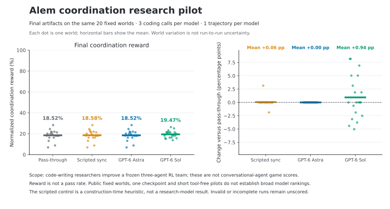

# Researcher pilot: complete results

Two short researcher attempts produced one conservative baseline retention and
one modest improvement. GPT-6 Astra finished at **18.5220%** normalized
coordination reward; GPT-6 Sol finished at **19.4654%**, a **0.9434 percentage-point
gain** over the matched pass-through baseline. Both final controllers completed
all 20 prescribed worlds. These percentages are rewards, not pass rates.

The research agents wrote Python controllers for an existing frozen three-agent
RL team. They were not conversational agents playing the game. The contribution
is a runnable OpenRSI research task on Alem; see the [prior-art audit](../NOVELTY.md).



## Fixed protocol and outcomes

The task, assets, baseline, prompt construction and three-call pilot protocol
were committed at
[`d4bdd34f4170d2e61f24527d7ed68b3ad0866492`](https://github.com/y12uc231/OpenRSI-Index/tree/d4bdd34f4170d2e61f24527d7ed68b3ad0866492/contributor-work/alem-coordination)
before researcher inference. Each requested model alias received one tool-free,
three-call trajectory at `ultra` reasoning effort. Calls 1 and 2 received
aggregate feedback on four development worlds. Call 3 supplied the final
artifact, evaluated once on twenty fixed evaluation worlds. There were no
replacement generations, repair calls, discarded failures or best-of selection.

| Arm | Development call 1 | Development call 2 | Final 20-world reward | Final gain vs. reference |
| --- | ---: | ---: | ---: | ---: |
| Matched pass-through | 22.4843% reference | 22.4843% reference | 18.5220% | 0 pp |
| Scripted visible-sync control | Not run | Not run | 18.5849% | +0.0629 pp |
| GPT-6 Astra | 15.8805% | 22.4843% | 18.5220% | 0 pp |
| GPT-6 Sol | 17.7673% | 19.8113% | 19.4654% | +0.9434 pp |

The development reference above is one baseline measurement, repeated in the
table only for comparison. Development and final workloads differ; their raw
scores must not be treated as the same learning curve. The initial packet
provided the evaluation reference aggregate; Astra used its second call to
measure pass-through on development. This is a short construction pilot, not
the proposed 24-hour research run with tools.

Astra initially implemented directional invitations and a local readiness
quorum for synchronized resource collection. Its development result regressed,
so it checked and retained pass-through. That is a valid conservative decision.
Its final controller exactly reproduces every baseline trajectory and metric.

Sol initially combined handover priority, local slot assignment and a native
message quorum. It revised the controller to use bounded path searches, exact
quorum sizes, target readiness and tool checks. The final source is byte-for-byte
identical to its second generation (SHA-256
`3862d57dbf57dbb8e1f2efff6cd32a345dd7006a0dab58d40b45e0ff5ae38d89`).
On evaluation, it improved 8 worlds, tied 5 and regressed on 7. It overrode
1,009 of 28,713 actor actions (3.51%).

The scripted control was authored by the assistant during task construction.
The machine-readable source label `author-written heuristic` denotes that
control; it is not an independent human or researcher-model result. It made
only nine overrides, changing two world scores in opposite directions. Such
an inactive heuristic cannot establish task difficulty.

## Behavior and interpretation

| Final metric | Pass-through | Sol |
| --- | ---: | ---: |
| Coordination reward | 18.5220% | 19.4654% |
| Base reward | 14.2627% | 14.4931% |
| Total reward | 16.0638% | 16.5957% |
| Soft coordination reward | 21.2500% | 23.2500% |
| Hard-sync coordination reward | 14.1477% | 14.9432% |
| Handover coordination reward | 85% | 85% |
| Construction coordination reward | 0% | 0% |
| Joint environment steps, total | 8,489 | 9,571 |
| Alive-agent steps, mean per world | 1,064.05 | 1,117.25 |
| Sync attempts, mean per world | 10.45 | 14.80 |
| Sync successes, mean per world | 4.65 | 5.25 |
| Native communication actions, total | 386 | 872 |

Both survival and synchronization changed. More synchronization successes do
not establish more efficient coordination: the mean episode synchronization
success rate fell from 0.5695 to 0.4621. No ablation isolates a causal mechanism.
Construction was never attempted, so its zero reward does not demonstrate
inability on construction opportunities. A claim that the learned base policy
is essential would also require controller-only/no-logits ablations.

## Cost and provenance

| Researcher | Accepted coding responses | Input tokens | Inclusive output tokens | Total tokens | Full trajectory wall time |
| --- | ---: | ---: | ---: | ---: | ---: |
| GPT-6 Astra | 3 | 176,289 | 21,594 | 197,883 | 1,292.34 s |
| GPT-6 Sol | 3 | 277,470 | 67,703 | 345,173 | 2,590.41 s |

Output already includes reasoning; cached input is already included in input.
The recorded cached-input subsets were 70,400 and 145,024; reasoning-output
subsets were 17,649 and 51,624. Adding them again would double-count usage.
Three calls means three accepted CLI coding responses; internal service call
counts are not exposed. These are requested provider aliases, without immutable
server snapshot identifiers. Token budgets were not matched.

Researcher calls overlapped and simulator checks used a shared lock. Wall times
include waiting and must not be added into a study elapsed time or used as a
speed ranking. Original final Docker evaluations took 277.79 s for Astra and
310.75 s for Sol. The game actors used no LLM inference or training.

The independent exporter verifies the frozen commit and source hashes,
declared packet, baseline, exact candidate bytes, source/checkpoint manifests,
runtime images, all prescribed outcomes and reward aggregation. It retains
invalid/infrastructure/incomplete outcomes as unscored, never as zero or a
dropped world. Eleven offline exporter tests pass.

## Single-container deployment validation

The original study used isolated Docker workers. The submission route uses
three private actor processes inside one ordinary Linux container, without
nested Docker or a host socket. Its unchanged pass-through reproduced all
20 complete state/latent/action trace hashes, rewards and episode lengths in
145.39 s. Exactly one deployment replay of Sol's unchanged final artifact also
matched all 20 original traces, rewards and action counts, in 130.38 s.
Both used four CPUs, a 16 GiB memory cap and zero GPUs.

These are deployment checks, not additional researcher attempts or independent
performance replicates. All integration failures and the earlier one-world
trace mismatch remain in the [deployment ledger](../native/evidence/README.md).
The final route's filesystem permits one fixed private scratch file rather
than a general writable temporary directory. Arbitrary controller equivalence
and x86_64 kernel execution are not claimed. Full Harbor/RSI-Harness validation
remains a downstream stage.

## Prepared open-model comparison

The [compatible endpoint adapter and pinned Qwen lane](../pilot/OTHER-MODELS.md)
are prepared. A later [CPU-only tokenizer check](qwen-tokenizer-planning.json)
verified all six observed prompt texts against the pinned Qwen3.8-27B tokenizer
and native chat template. They occupy 25,980–30,564 tokens; each fits a 65,536
context with the full 32,768-token completion reservation (smallest margin:
2,204 tokens). This updates the archived pre-pilot planning status without
changing the frozen pilot packet.

No Qwen weights, GPU, serving endpoint or inference run was used. Actual vLLM
preflight and resource measurements remain unvalidated; longer future prompts
must be rejected if they do not fit, not silently truncated. The optional
serving estimate is one H100 80 GB, 16 CPU cores and 128 GiB RAM. The evaluation
task itself requires no GPU. Paid-provider adapters are not implemented.

## Evidence and reproduction

- [Comparison data](comparison.json): every final world, all generation scores,
  usage and behavioral diagnostics.
- [Astra](astra-001/summary.json), [Sol](sol-001/summary.json) and
  [scripted control](visible-sync-001/summary.json): checked summaries; each
  directory preserves exact code, final outcomes and a file-hash manifest.
- [Safe exporter](export_alem_researcher.py),
  [control exporter](export_alem_control.py),
  [comparison builder](compare_alem_researcher.py) and
  [tests](test_export_alem_researcher.py).
- [Plot script](plot_alem_pilot.py) and
  [offline tokenizer planning script](check_alem_tokenizer.py).
- [Native entrypoint and isolation contract](../native/README.md),
  [development protocol](../pilot/PROTOCOL.md) and
  [fixed baseline](../controller/evidence/evaluation-baseline.json).

From this results directory, the plot can be rebuilt with Matplotlib 3.10.3:

```sh
python plot_alem_pilot.py \
  --baseline ../controller/evidence/evaluation-baseline.json \
  --results . --output /tmp/alem-pilot-figure
python -m unittest test_export_alem_researcher -v
```

The plotted twenty dots are fixed-world outcomes, not twenty independent
researcher attempts or an uncertainty interval. Public seeds, one checkpoint,
one trajectory per alias and three tool-free calls do not establish broad
rankings, unseen-world generalization or full-budget research difficulty.
The positive Sol result is retained. There is no evidence here for claiming
that most models fail this task.
