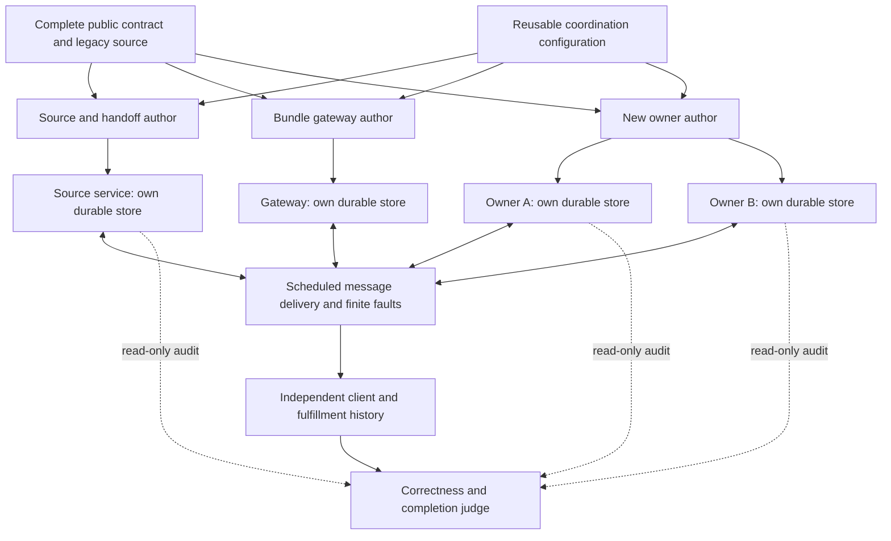

# What the team builds and what the judge measures

Three coding agents produce cooperating service implementations. Their programs
then run as four independently persisted services. These are separate layers:
the coding agents are being evaluated; the service network is their test problem.

For example, a request needs both X and Y while X moves to A and Y moves to B.
The implementation must preserve its identity, inventory obligations and final
decision despite delayed or repeated messages. Repairing a database later does
not erase an earlier incorrect fulfillment. A valid different ordering of
competing requests is accepted by the independent history checker.

The judge also requires progress: unaffected Z traffic must finish during its
stable window, and completed migration must work after the old authority is
withdrawn. It permits affected work to wait while necessary participants are
unavailable. Recovery is eventual; permanent partition availability is not
required.

Each callback sees only its node's database. The Docker boundary does not mount
other stores, the oracle, or hidden schedules. The same owner module runs at A
and B with separate state. A single coding agent is also allowed to implement
all components as a control; cross-service agreement does not prove multiple
LLM authors are necessary.

Current scope is a prototype under validation. The checker exhaustively decides
linearizability of each small observed client history, not correctness under
every possible network schedule. Model difficulty and a teamwork advantage
remain measurements to make after the implementation is frozen.
